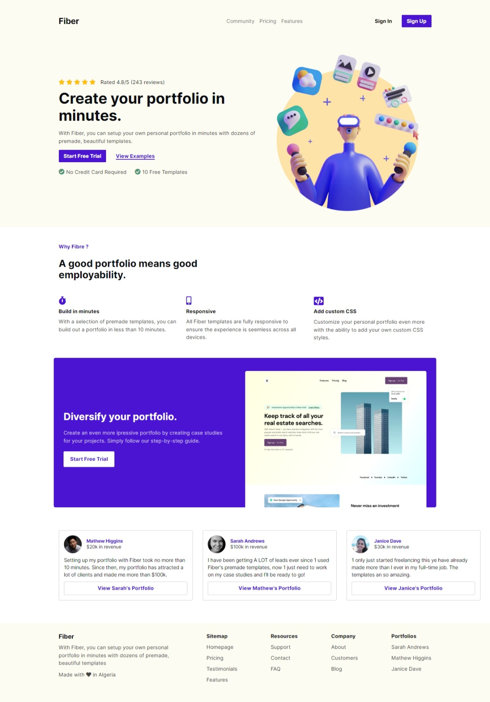
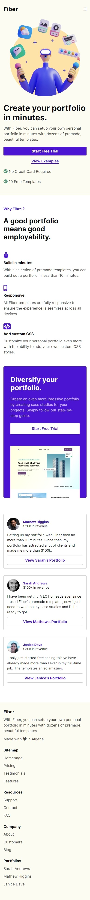
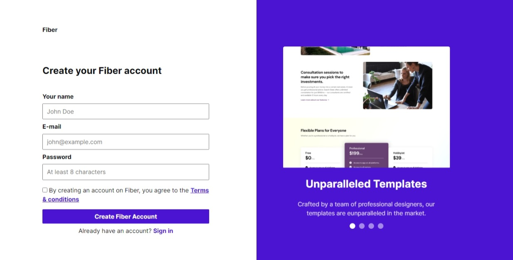
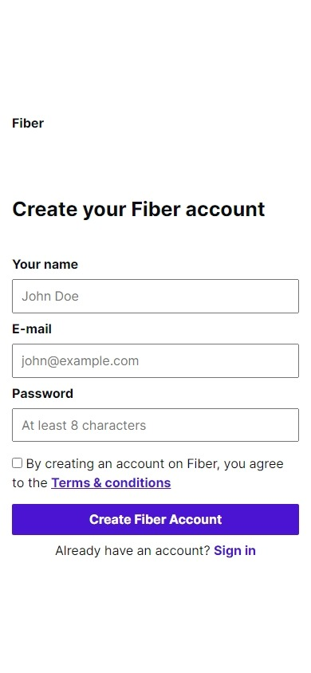

# Fiber Project from codewell

### The challenge

Users should be able to:

- View the optimal layout for the site depending on their device's screen size

### Live Demo:

#### 

### Screenshot

#### Home page

##### Desktop

##### Phone

#### Sign up page

##### Desktop

##### Phone

## My process

### Built with

- Semantic HTML5 markup
- CSS custom properties
- Flexbox
- CSS Grid

## Author

- Github - [Hakiki Ahmed Djeber](https://github.com/HakikiAhmedDjeber)
